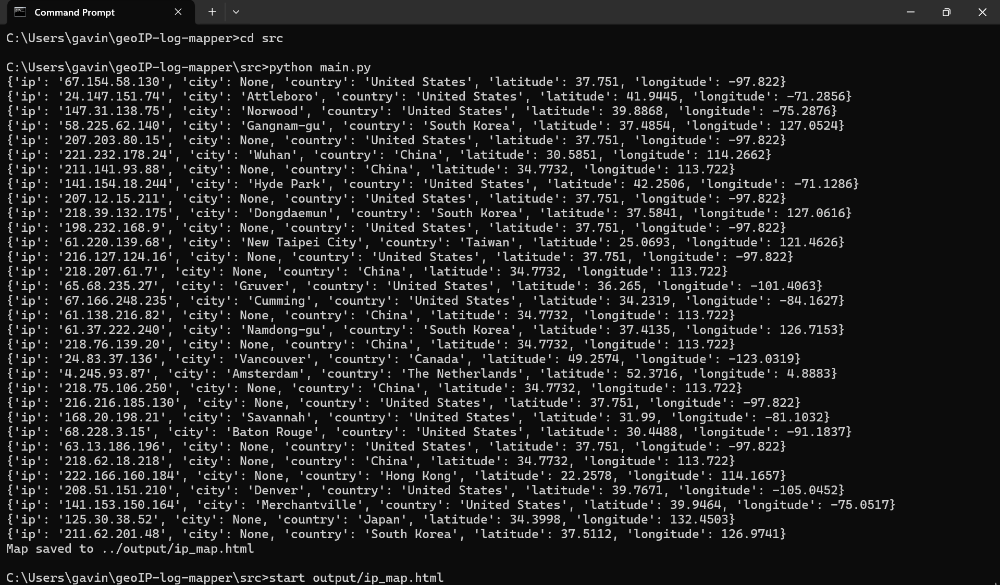
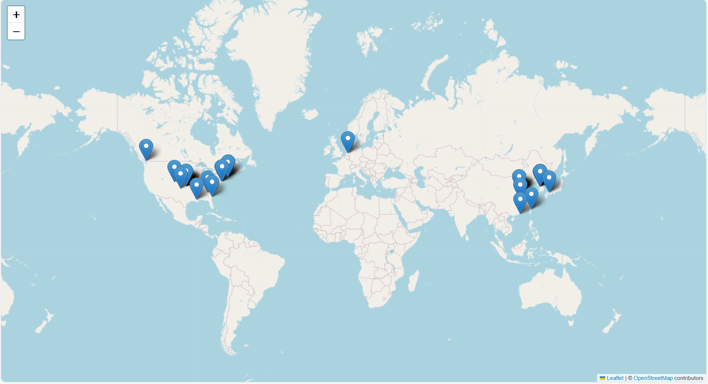

# Project: geoIP-log-mapper
# Overview
This project is a GeoIP Log Mapper, which takes IP addresses from server log files and maps their geographic locations on an interactive world map. I built this tool to practice working with log data, understand how IP addresses can reveal information about network activity, and learn how to visualize that data. This kind of tool helps solve the problem of identifying where traffic or potential threats are coming from — which is a key part of incident response and threat analysis. It’s relevant to cybersecurity because being able to trace IPs back to their origin can help detect suspicious activity, such as brute-force attacks or unauthorized access attempts from unusual regions. Security Operations Center (SOC) analysts, cybersecurity learners, and developers who want to better understand network behavior could all benefit from a tool like this.

# Features
- Log File Parsing – Automatically extracts IP addresses from log files (In this case, Apache logs).

- GeoIP Lookup – Uses the MaxMind GeoLite2-City database to map IPs to real-world geographic locations (country, city, latitude, longitude).

- Interactive Map Visualization – Displays the geolocated IP addresses on an interactive world map using ‘folium’.

- Modular Code Design – Organized into separate modules for parsing, geolocation, and visualization, making the project easy to understand and extend.

- Error Handling – Skips IPs that cannot be geolocated and provides helpful error messages.

- Supports Real Log Files – Compatible with real-world log formats, making it a useful foundation for more advanced threat analysis projects.

# Tools & Technologies
Python 3 – Core programming language used for all scripts.
GeoIP2 – Python client library used to access the MaxMind GeoLite2 City database for IP geolocation.
Folium – Python library used to generate interactive maps based on IP coordinates.
Regex (re module) – Used to extract IP addresses from raw log files.
MaxMind GeoLite2-City Database – Free geolocation database used to map IPs to locations.

# Setup & Installation
Provide step-by-step instructions (Windows CMD). 
For example:

#Clone the repository
git clone
https://github.com/Gavin-Main/geoIP-log-mapper/

#Navigate into the project
Cd 

#Install dependencies
pip install geoip2
Pip install folium

#Navigate to src folder
cd src

#Run the script
python main.py

#After seeing this message: “Map saved to ../output/ip_map.html” #Navigate to project directory
cd ..

#Check map for IP Locations
Start output/ip_map.html

#Your browser will then open a map with icons marking the location of the IPs in the log file

# Usage Examples

# Project Structure
geoIP-log-mapper/
|---src/                   #Source Code
|   |---parser.py          #Extracts IP addresses from log files
|   |---visualize.py       #Creates interactive map with IP data
|   |---geolocate.py       #Looks up geographic info for each IP address
|   |---main.py            #Main script that runs all scripts
|---images/                #Contains images showing output
|---logs/                  #Contains Sample Apache Log with IP addresses
|---geoip2-db/             #Contains GeoLite2-City.mmdb database file
|---output/                #Stores generated interactive IP map
|---README.md              #Project description

# Security Context / Learning Outcomes
This project helped me understand how IP addresses found in log files can be used to analyze network activity, which is an important part of cybersecurity. Geolocating IPs and mapping them visually allowed me to see where traffic is coming from, which can help identify unusual or potentially malicious activity—like login attempts from unexpected countries. These kinds of insights are useful in real-world security operations, such as threat detection, incident response, and access monitoring. Through this project, I gained hands-on experience with working on logs, interpreting IP data, and using external tools like geolocation databases and visualization libraries—all of which are relevant skills in the cybersecurity field.

# Future Improvements
- Add a Web Interface
- Integrate Threat Intelligence API’s
- Support more Log Formats (SSH, firewall, Windows Event logs)
- Dockerize Project
- Improve Error Handling

# References
Jieming Zhu, Shilin He, Pinjia He, Jinyang Liu, Michael R. Lyu. Loghub: A Large Collection of System Log Datasets for AI-driven Log Analytics. IEEE International Symposium on Software Reliability Engineering (ISSRE), 2023.
